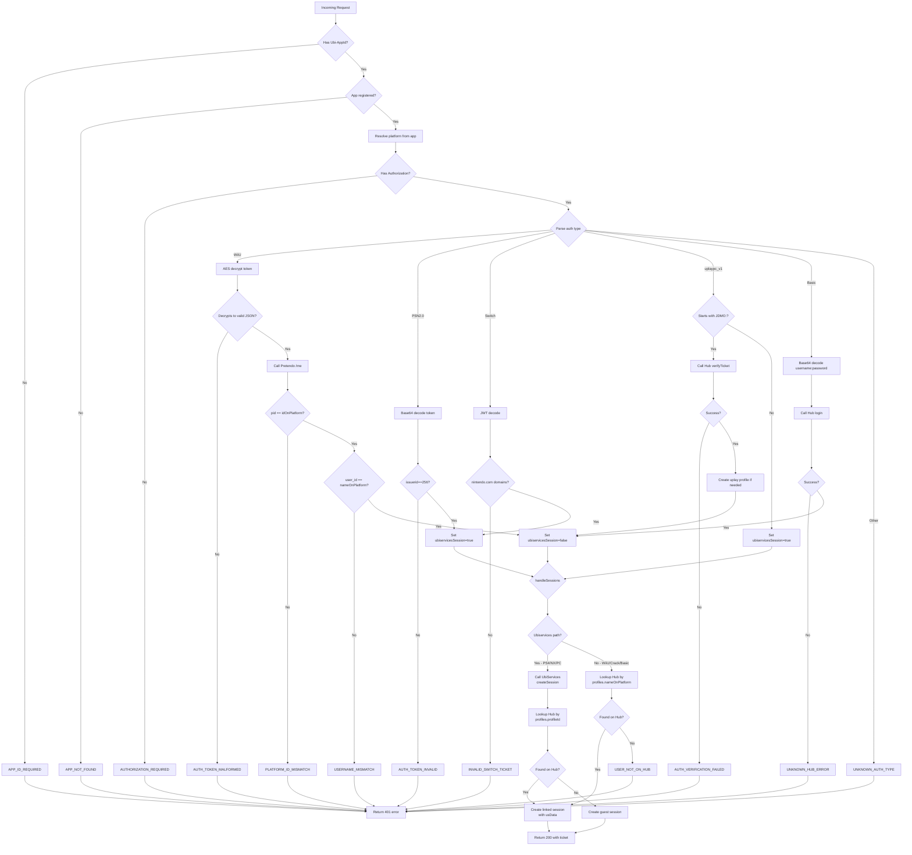

# Auth Architecture Overview

## Complete Auth Flow Diagram

```mermaid
graph TB
    subgraph Client["Game Client"]
        A[Just Dance<br/>Melody Online]
    end

    subgraph Harbour["Harbour Server"]
        direction TB
        
        subgraph Middleware["Middleware Layer"]
            M1[verifyAppByHeader]
            M2[verifyUserAgent]
            M3[verifyBuildId]
            M4[verifyAuth]
        end

        subgraph AuthHandlers["Auth Handlers"]
            W[lib/auth/wiiu.js<br/>WiiU - AES Decrypt + Pretendo]
            P[lib/auth/psn2.js<br/>PS4 - NP Ticket Parse]
            S[lib/auth/switch.js<br/>Switch - JWT Parse]
            PC[lib/auth/pc.js<br/>PC Official - UbiServices]
            PCJ[lib/auth/pc-crack.js<br/>PC Crack - Hub verifyTicket]
            B[lib/auth/basic.js<br/>Basic - Hub Login]
        end

        subgraph Session["Session Layer"]
            SC[session-client.js<br/>handleSessions]
            GUEST[Guest Session Path]
            LINKED[Linked Session Path]
            T[ticket-client.js<br/>ticketRequired]
        end

        subgraph Lib["Supporting Libraries"]
            H[hub-helper.js<br/>Hub API Client]
            U[ubiservices.js<br/>UbiServices API Client]
            PR[pretendo.js<br/>Pretendo API Client]
        end
    end

    subgraph External["External Services"]
        UB[Ubisoft<br/>UbiServices]
        HUB[DanceParty<br/>Hub]
        PRET[Pretendo<br/>Network]
    end

    subgraph Storage["Internal Storage"]
        R[(Redis<br/>Sessions)]
        M[(MongoDB<br/>Ubiservices Sessions)]
    end

    %% Client → Harbour
    A -->|1. POST /sessions<br/>Authorization: &lt;platform token&gt;| M1
    M1 --> M2
    M2 --> M3
    M3 --> M4

    %% Auth routing
    M4 -->|WiiU| W
    M4 -->|PSN2.0| P
    M4 -->|Switch| S
    M4 -->|uplaypc_v1 + JDMO:| PCJ
    M4 -->|uplaypc_v1| PC
    M4 -->|Basic| B

    %% Auth → External verification
    W -->|AES decrypt + verify| PR
    PR -->|GET /v1/api/people/@me/profile| PRET
    
    P -->|Set ubiservicesSession=true| SC
    S -->|Set ubiservicesSession=true| SC
    PC -->|Set ubiservicesSession=true| SC
    
    PCJ -->|POST /auth/v1/verify-ticket| H
    PCJ -->|Create uplay profile if missing| H
    H -->|POST /auth/v1/verify-ticket| HUB

    B -->|POST /auth/v1/session| H
    H -->|POST /auth/v1/session| HUB

    %% Session routing
    W -->|ubiservicesSession=false| SC
    PCJ -->|ubiservicesSession=false| SC
    B -->|ubiservicesSession=false| SC
    
    SC -->|platform in UBISERVICES_PLATFORMS<br/>&& ubiservicesSession| GUEST
    SC -->|platform in UBISERVICES_PLATFORMS<br/>&& ubiservicesSession| LINKED
    
    GUEST -->|POST /v{version}/profiles/sessions| U
    LINKED -->|POST /v{version}/profiles/sessions| U
    U -->|Verify + get identity| UB
    
    GUEST -->|Lookup profileId| H
    H -->|GET /users/v1| HUB
    
    LINKED -->|Lookup profileId| H
    H -->|GET /users/v1| HUB

    %% Session storage
    LINKED -->|Create Harbour ticket| R
    GUEST -->|Create Harbour ticket| R
    LINKED -->|Store us-session| M
    GUEST -->|Store us-session| M

    %% Response
    R -->|Return ticket to client| A
```

## Platform Decision Tree



## Session Ticket Lifecycle

```mermaid
sequenceDiagram
    participant C as Client
    participant H as Harbour
    participant R as Redis
    
    Note over C,H: LOGIN
    C->>H: POST /sessions (platform token)
    Note over H: Verify platform token
    Note over H: Lookup/create Hub profile
    H->>H: session.createSession()
    Note over H: Encrypt claims into ticket<br/>Store in Redis with TTL
    H-->>C: 200 { ticket, ... }
    
    Note over C,H: API CALLS (recurring)
    C->>H: GET /profiles (Authorization: Ubi_v1 t=&lt;ticket&gt;)
    H->>H: ticketRequired() → decrypt ticket
    H-->>C: 200 { profiles }
    
    Note over C,H: LOGOUT
    C->>H: DELETE /sessions (Authorization: Ubi_v1 t=&lt;ticket&gt;)
    H->>R: Delete session from Redis
    H-->>C: 200 {}
```

## File Dependency Graph

```mermaid
graph LR
    subgraph Entry
        S[server.js]
        MW[middleware.js]
    end
    
    subgraph Auth
        W[wiiu.js]
        P[psn2.js]
        SW[switch.js]
        PC[pc.js]
        PCJ[pc-crack.js]
        B[basic.js]
    end
    
    subgraph Session
        SC[session-client.js]
        T[ticket-client.js]
        TK[ticket.js]
    end
    
    subgraph Clients
        U[ubiservices.js]
        H[hub-helper.js]
        PR[pretendo.js]
    end
    
    subgraph Data
        PL[platforms.js]
        BD[banned-devices.js]
        HC[http-codes.js]
        HS[http-schema.js]
    end
    
    subgraph Config
        C[config.js]
    end

    S --> MW
    S --> SC
    S --> T
    
    MW --> W
    MW --> P
    MW --> SW
    MW --> PC
    MW --> PCJ
    MW --> B
    
    W --> PR
    W --> HC
    W --> BD
    
    P --> HC
    
    SW --> HC
    
    PC --> U
    PC --> HC
    
    PCJ --> H
    PCJ --> HC
    
    B --> H
    B --> HC
    
    SC --> U
    SC --> H
    SC --> TK
    SC --> HC
    
    T --> TK
    T --> HC
    
    MW --> HS
    MW --> HC
    
    MW --> C
    SC --> C
    T --> C
    W --> C
    PCJ --> C
    B --> C
    H --> C
    U --> C
