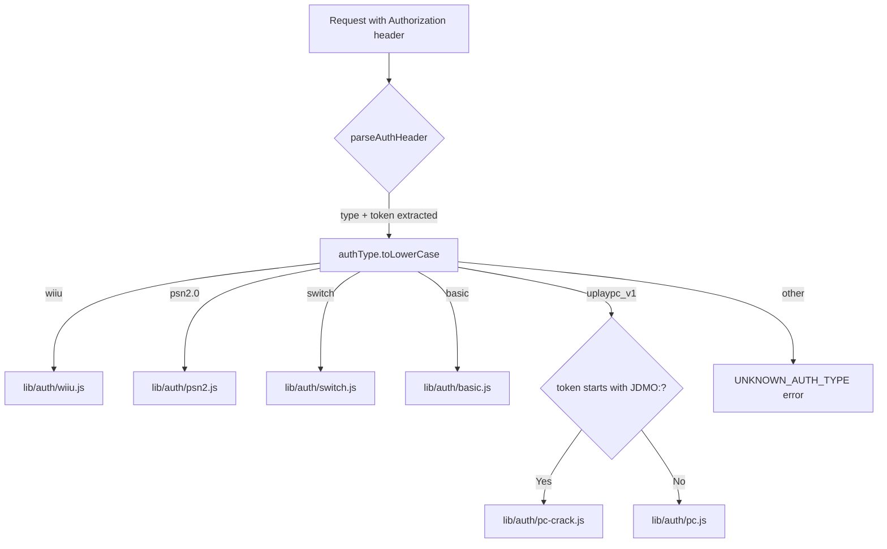
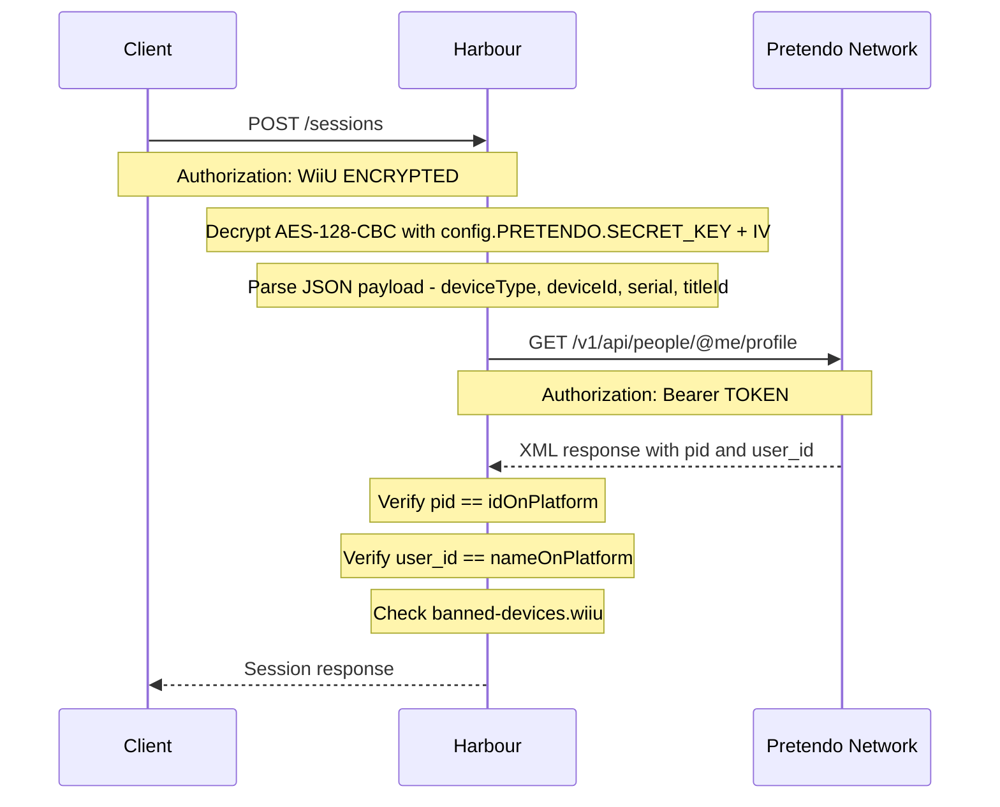
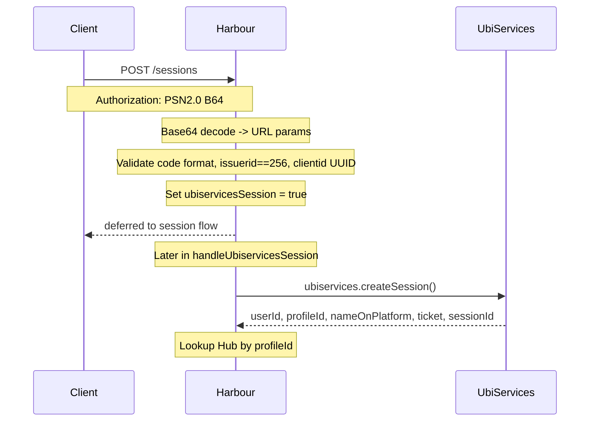
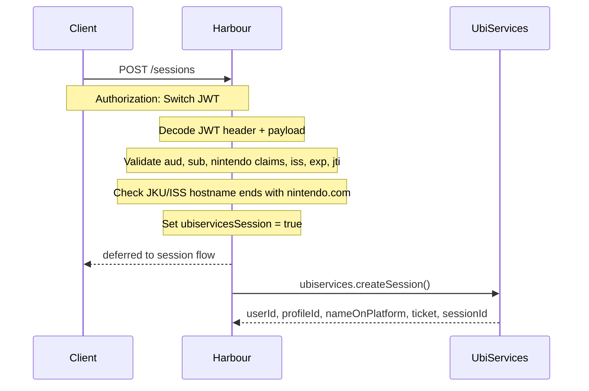
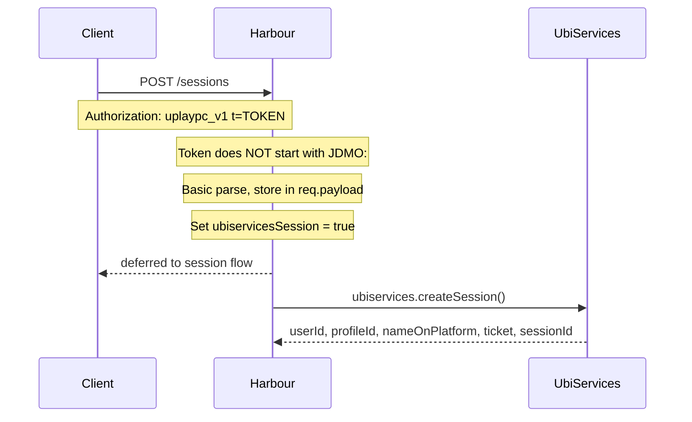
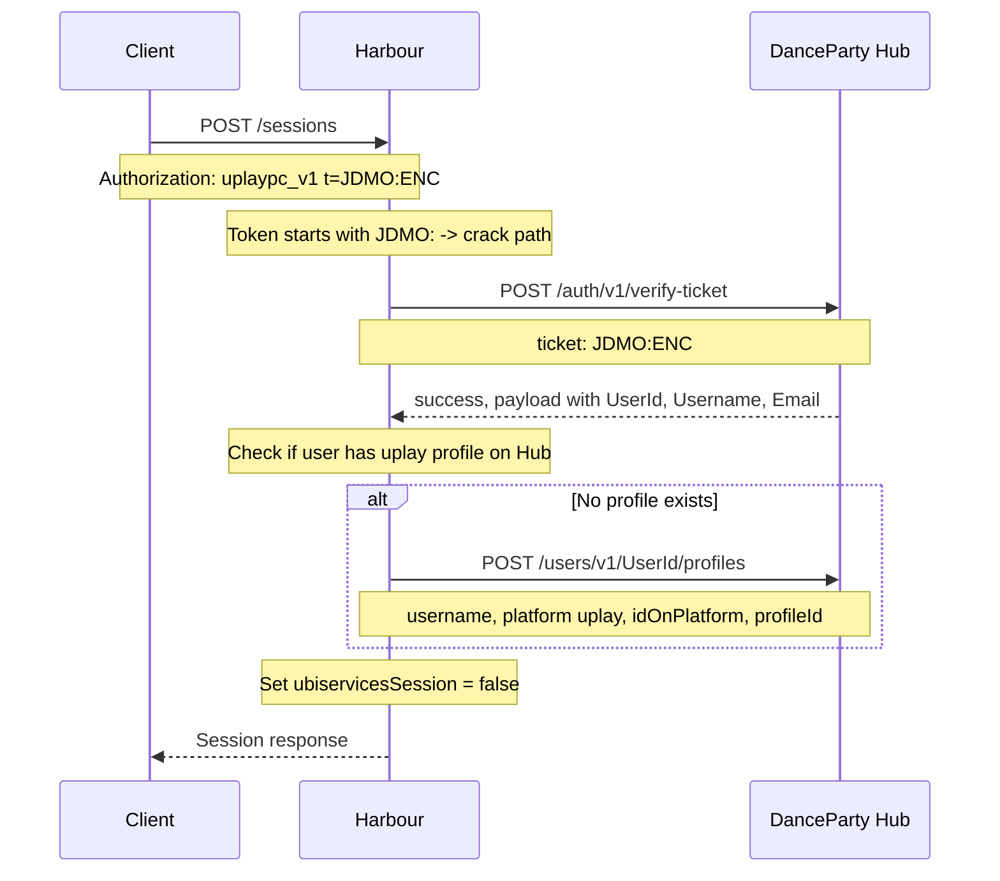
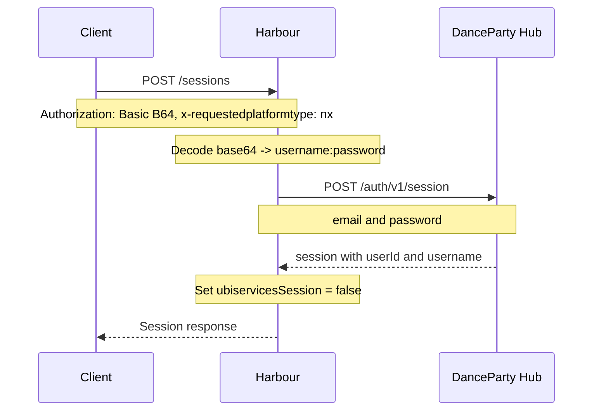

# Layer 1: Platform Token Authentication

The first authentication layer validates the credential that a game client sends to prove it owns a platform account. This happens in `verifyAuth` middleware and is dispatched to the correct `lib/auth/<name>.js` handler based on the `Authorization` header scheme.

## Entry Point: `verifyAuth`

**File:** `src/lib/middleware.js` → `verifyAuth()`



### Header Parsing

The `parseAuthHeader` helper splits `Authorization: <type> <token>` and strips `t=` / `x=` prefixes that some Ubisoft client builds prepend:

```
Input:  "uplaypc_v1 t=JDMO:abc123"
Output: type="uplaypc_v1", token="JDMO:abc123"

Input:  "WiiU <base64>"
Output: type="WiiU", token="<base64>"
```

---

## WiiU (`lib/auth/wiiu.js`)

### Token Format

```
Authorization: WiiU <aes-128-cbc-encrypted-json>
```

### Flow



### Key Points

- **Decryption:** AES-128-CBC with key/IV from `config.PRETENDO`. The token must be valid base64 and decrypt to a JSON payload.
- **Expiry:** The `timestamp` field in the decrypted payload is checked — must be within 24 hours of server time.
- **Identity Verification:** Calls Pretendo's `/me` endpoint with the bearer token embedded in the encrypted payload. The returned `pid` (player ID) must match `idOnPlatform` from the request body, and `user_id` must match `nameOnPlatform`.
- **Ban Check:** Checks `banned-devices.wiiu` array.
- **Session Flow:** `req.ubiservicesSession = false` → routes to `handleStandardSession`.

### Required Request Body Fields

```json
{
  "idOnPlatform": "<pretendo-pid>",
  "nameOnPlatform": "<pretendo-username>"
}
```

---

## PS4 / PSN2.0 (`lib/auth/psn2.js`)

### Token Format

```
Authorization: PSN2.0 <base64-encoded-url-params>
```

The token is a base64-encoded URL query string:
```
code=<np-ticket-code>&issuerid=256&clientid=<uuid>
```

### Flow



### Key Points

- **Local Validation:** Extracts `code` (NP ticket), `issuerid` (must be `"256"` for PS4), and optional `clientid` (UUID format).
- **No Public Verify API:** Sony does not expose a public API to verify PSN credentials server-side. Harbour trusts the body-supplied `idOnPlatform` and `nameOnPlatform`.
- **`ubiservicesSession = true`:** The actual identity verification against the real Ubisoft servers happens later in `handleUbiservicesSession`, where the raw PSN ticket is forwarded to UbiServices.
- **Guest Sessions:** If the UbiServices profile ID isn't linked to any Hub user, a **guest session** is created (unlike WiiU which blocks).

---

## Nintendo Switch (`lib/auth/switch.js`)

### Token Format

```
Authorization: Switch <jwt>
```

The token is a standard JWT with three dot-separated base64 sections: `header.payload.signature`.

### Flow

Same pattern as PS4:



### Key Points

- **JWT Structural Validation:** Decodes and validates the JWT structure — required fields: `aud`, `sub`, `nintendo`, `iss`, `exp`, `iat`, `jti`. Algorithm (`alg`), key ID (`kid`), and JWK URL (`jku`) must be present in the header.
- **Nintendo Domain Check:** Both `jku` hostname and `iss` hostname must end with `nintendo.com`.
- **Expiry Check:** The `exp` claim is checked against the current time (bypassed in dev mode).
- **`ubiservicesSession = true`:** Same as PS4 — actual identity verification forwarded to UbiServices.

---

## Official Uplay PC (`lib/auth/pc.js`)

### Token Format

```
Authorization: uplaypc_v1 t=<raw-ubisoft-token>
```

### Flow



### Key Points

- **No local user identity parsing:** Unlike PSN/Switch tokens which are structurally parsed to extract `nameOnPlatform`, official Uplay PC tokens have no parseable user identity on Harbour's side. Everything comes from the UbiServices response.
- **`ubiservicesSession = true`:** The `ubiservices.createSession()` call in `handleUbiservicesSession` does the actual verification against Ubisoft's servers using the raw token.
- **`nameOnPlatform` fallback:** Since `pc.verify()` doesn't set `req.nameOnPlatform`, the session-client fills it from the UbiServices response (`usNameOnPlatform`).

---

## Cracked Uplay PC (`lib/auth/pc-crack.js`)

### Token Format

```
Authorization: uplaypc_v1 t=JDMO:<encrypted-ticket>
```

### Flow



### Key Points

- **`JDMO:` Prefix:** The `JDMO:` prefix is the magic identifier for crack tokens. Tokens without this prefix on the `uplaypc_v1` scheme route to the official PC handler instead.
- **Hub Verification:** The full `JDMO:<encrypted>` string is sent to the Hub's `/auth/v1/verify-ticket` endpoint, which decrypts it, validates the auth file password, checks expiry, and returns the verified user identity.
- **Auto-Create Profile:** If the user doesn't have a `uplay` profile on the Hub yet, one is created automatically with a new UUID.
- **`ubiservicesSession = false`:** Crack tokens bypass UbiServices entirely — identity comes from the Hub's ticket verification.
- **Session Flow:** Routes to `handleStandardSession` since `ubiservicesSession` is `false` and the platform ID (`uplay`) is in `UBISERVICES_PLATFORMS` — **but** the `ubiservicesSession` check in `handleSessions` requires **both** conditions to be true. Since it's `false`, it takes the standard (non-Ubiservices) path.

The `handleSessions` routing logic is:

```js
if (UBISERVICES_PLATFORMS.includes(platformId) && req.ubiservicesSession) {
    return await handleUbiservicesSession(req, res, next);
}
return await handleStandardSession(req, res, next);
```

For crack PC tokens, `req.ubiservicesSession` is `false`, so it routes to `handleStandardSession`. But `pc-crack.verify()` sets `req.platform = { id: "uplay" }` and `req.nameOnPlatform = Username`, so `handleStandardSession` looks up the Hub by `{ "profiles.nameOnPlatform": Username }`. This is a different lookup than the `{ userId: UserId }` lookup already done in `pc-crack.verify()`. The crack path effectively does **two** Hub lookups — one in the auth handler (to find/create the uplay profile) and one in `handleStandardSession` (to find the user by `nameOnPlatform`).

---

## Basic Auth (`lib/auth/basic.js`)

### Token Format

```
Authorization: Basic <base64(username:password)>
```

### Flow



### Key Points

- **Privileged Bypass:** Basic auth works regardless of which platform the app is registered under. It's a server-to-user authentication, not a console-to-server authentication.
- **`x-requestedplatformtype` Header:** Required for Basic auth — specifies which platform profile to target on the Hub (e.g., `nx`, `ps4`, `wiiu`, `uplay`).
- **Hub Login:** Delegates to the Hub's standard email/password login endpoint.
- **`ubiservicesSession = false`:** Routes to `handleStandardSession`.

---

## Dispatch Logic

The routing between all handlers is in `verifyAuth` in `src/lib/middleware.js`:

```javascript
const verifyAuth = (req, res, next) => {
  // ...
  switch (authType.toLowerCase()) {
    case "wiiu":       return wiiu.verify(req, res, next);
    case "psn2.0":     return psn2.verify(req, res, next);
    case "switch":     return authSwitch.verify(req, res, next);
    case "basic":      return basic.verify(req, res, next);
    case "uplaypc_v1":
      if (token.startsWith("JDMO:")) return pcCrack.verify(req, res, next);
      return pc.verify(req, res, next);
    default:
      return next(UNKNOWN_AUTH_TYPE);
  }
};
```

### What Each Handler Sets on `req`

| Handler | `idOnPlatform` | `nameOnPlatform` | `platformType` | `platform` | `ubiservicesSession` | `payload` |
|---|---|---|---|---|---|---|
| `wiiu.verify` | Pretendo PID | Pretendo username | `"wiiu"` | (from app) | `false` | Decrypted token JSON |
| `psn2.verify` | From `req.body` | From `req.body` | `"psn"` | (from app) | `true` | `{ code, issuerId, clientId }` |
| `switch.verify` | From `req.body` | From `req.body` | `"switch"` | (from app) | `true` | `{ header, payload, rawToken }` |
| `basic.verify` | Hub userId | Hub username | `"uplay"` | (from app) | `false` | `{ username, password }` |
| `pc.verify` | — | — | — | (from app) | `true` | `{ token }` |
| `pc-crack.verify` | Hub profileId | Hub username | `"uplay"` | `{ id: "uplay" }` | `false` | `{ ticket }` |
