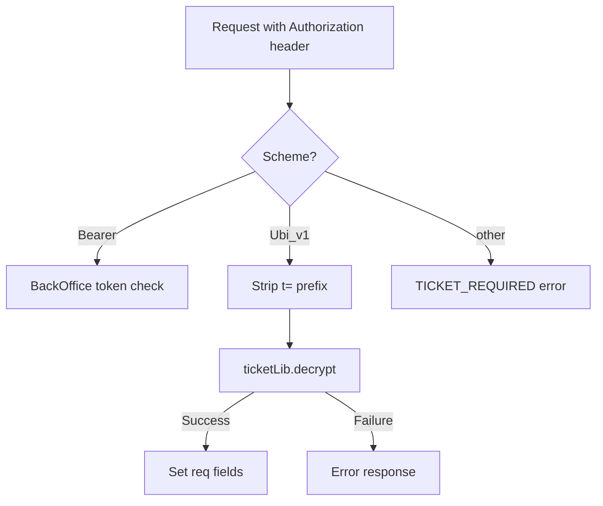

# Layer 2: Harbour Session Tickets

Once a user has been authenticated via their platform token (Layer 1), Harbour issues its own JWT-style **session ticket**. All subsequent API calls use this ticket instead of the platform credential.

## Ticket Format

```
Authorization: Ubi_v1 t=<base64-encrypted-ticket>
```

The ticket is an **encrypted JSON payload** — not a standard JWT. It's encrypted and decrypted using `lib/ticket.js`.

### Decrypted Claims

```json
{
  "uid": "<hub-user-uuid>",
  "pid": "<hub-profile-uuid>",
  "aid": "<app-uuid>",
  "spid": "<space-uuid>",
  "sid": "<session-uuid>",
  "platform": "nx",
  "guest": false,
  "admin": false,
  "mod": false,
  "patreon": false,
  "qa": false,
  "s2s": false,
  "jmcsEnv": "prod",
  "exp": 1712345678
}
```

| Claim | Field | Description |
|---|---|---|
| `uid` | `req.userId` | Hub user UUID |
| `pid` | `req.profileId` | Hub profile UUID |
| `aid` | `req.appId` | Application UUID |
| `spid` | `req.spaceId` | Space/product UUID |
| `sid` | `req.sessionId` | Session UUID (used for cache lookups) |
| `platform` | `req.platform` | Platform ID string (e.g. `"nx"`) |
| `guest` | `req.isGuest` | `true` if this is a guest session |
| `admin` | `req.isAdmin` | Admin flag |
| `mod` | `req.isModerator` | Moderator flag |
| `patreon` | `req.isPatreon` | Patreon flag |
| `qa` | `req.isQA` | QA flag |
| `s2s` | `req.isS2s` | Server-to-server token flag |
| `jmcsEnv` | `req.jmcsEnv` | JMCS environment (`"prod"` / `"dev"`) |

## Middleware: `ticketRequired`

**File:** `src/lib/ticket-client.js`



### Usage

```javascript
// On any protected route:
publicRouter.get("/",
    ticketRequired,
    async (req, res) => {
        // req.userId, req.profileId, req.sessionId, etc. are available
    }
);

// For S2S-only routes:
publicRouter.get("/admin",
    ticketRequired,
    s2sTicketRequired,   // rejects non-S2S tickets
    async (req, res) => { }
);
```

### S2S Tokens

Server-to-server tokens have `s2s: true` in their claims. They:
- Do **not** set `req.userId` or `req.profileId` (they're not tied to a user)
- Only set `req.isS2s`, `req.appId`, `req.spaceId`, `req.sessionId`
- Use `s2sTicketRequired` middleware to restrict routes to S2S callers only

## Session Lifecycle

### Creation (`POST /sessions`)

```
Platform token verified → session.createSession()
  → Encrypt claims into ticket
  → Store session metadata in Redis
  → Return ticket to client
```

### Usage (subsequent requests)

```
Client sends Authorization: Ubi_v1 t=<ticket>
  → ticketRequired decrypts and validates
  → Route handler uses req.userId, req.profileId, etc.
```

### Deletion (`DELETE /sessions`)

```
Client sends Authorization: Ubi_v1 t=<ticket>
  → Session ID extracted from ticket
  → If Ubiservices session linked: delete from UbiServices + MongoDB
  → Delete from Harbour Redis cache
  → Return {}
```

### TTL

| Session type | TTL |
|---|---|
| Normal session | 3 hours |
| Remember-me session | 30 days |
| S2S token | 24 hours |

## Relationship Between Layers

The two layers serve different purposes and are verified by different parties:

| | Layer 1: Platform Token | Layer 2: Harbour Ticket |
|---|---|---|
| **Who issues it?** | Sony / Nintendo / Pretendo / Ubisoft | Harbour itself |
| **What does it prove?** | "I own this platform account" | "I have an active Harbour session" |
| **When is it sent?** | Once, during login | Every API request |
| **How is it verified?** | `lib/auth/*.js` handlers | `ticketLib.decrypt()` |
| **Middleware** | `verifyAuth` | `ticketRequired` |

```
┌─────────────────────────────────────────────────────┐
│                   Client                             │
│                                                      │
│  1. POST /sessions                                   │
│     Authorization: WiiU <aes-token>                  │
│                                                      │
│  2. ← 200 { ticket: "<harbour-jwt>", ... }          │
│                                                      │
│  3. GET /profiles/search                             │
│     Authorization: Ubi_v1 t=<harbour-jwt>            │
│                                                      │
│  4. ← 200 { profiles: [...] }                       │
└─────────────────────────────────────────────────────┘
```
