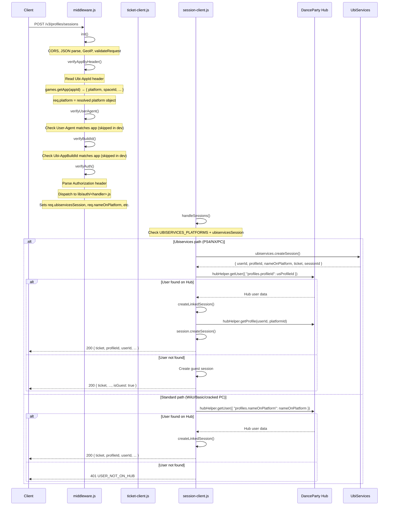
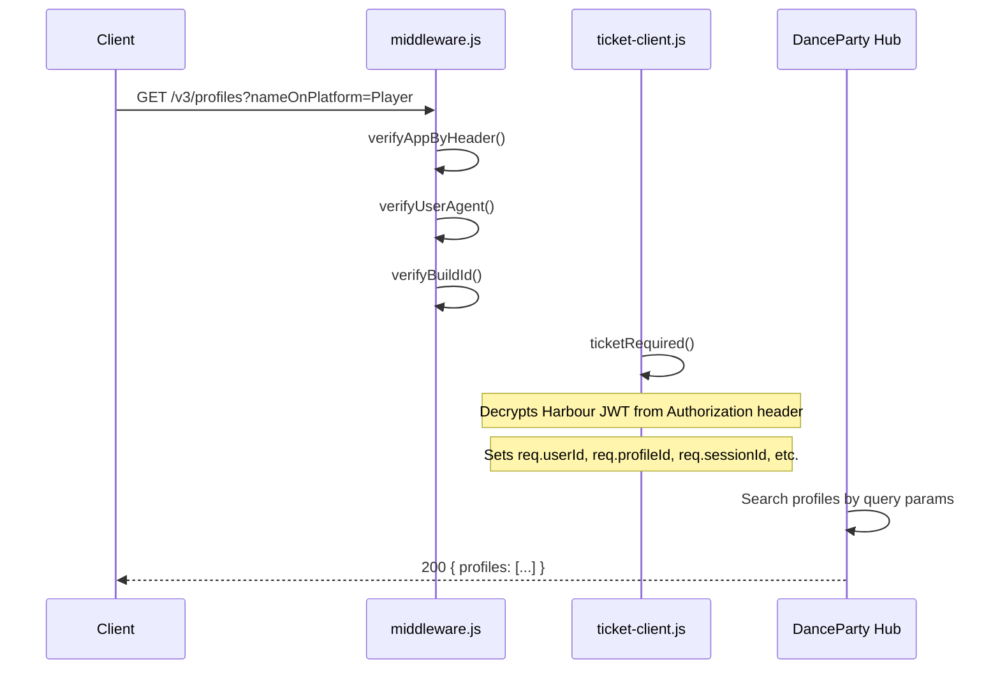
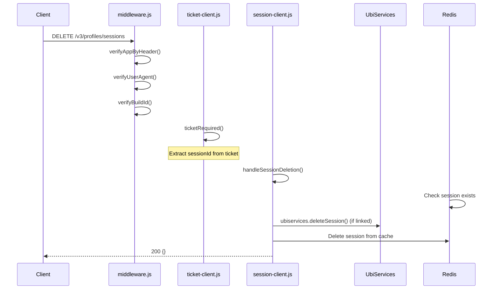

# Middleware Pipeline

The full middleware chain for a typical authenticated request.

## Route: `POST /v3/profiles/sessions` (Login)

This is the most complex route — it applies all three identity middleware layers plus the session handler.



## Route: `GET /v3/profiles` (Search)

A data route that only needs the Harbour session ticket (Layer 2), not the platform credential (Layer 1).



## Route: `DELETE /v3/profiles/sessions` (Logout)



## Middleware Configuration Order

The Express app mounts middleware in this order in `src/server.js`:

```
1. middleware.init(app)
   ├── CORS
   ├── express.json()
   ├── GeoIP middleware (CloudFlare or MaxMind)
   └── validateRequest (Joi schema)

2. Service-specific routes
   Each service file mounts its own middleware chain per-route.
   Typical chain for POST /sessions:
     verifyAppByHeader → verifyUserAgent → verifyBuildId → verifyAuth → handler

3. middleware.notFound (404 catch-all)

4. middleware.errorHandler (global error formatter)
```

## Request Flow Summary

```
                                 ┌──────────────────┐
                                 │                  │
                                 │  init()          │
                                 │  - CORS          │
                                 │  - JSON parsing  │
                                 │  - GeoIP         │
                                 │  - Joi validate  │
                                 │                  │
                                 └────────┬─────────┘
                                          │
                                 ┌────────▼─────────┐
                                 │                  │
                                 │  verifyAppBy-    │
                                 │  Header()        │
                                 │                  │
                                 │  Reads Ubi-AppId │
                                 │  Resolves app    │
                                 │  + platform      │
                                 │                  │
                                 └────────┬─────────┘
                                          │
                                 ┌────────▼─────────┐
                                 │                  │
                                 │  verifyUserAgent │
                                 │  verifyBuildId   │
                                 │  (dev bypass)    │
                                 │                  │
                                 └────────┬─────────┘
                                          │
                          ┌───────────────┴───────────────┐
                          │                               │
                 ┌────────▼─────────┐          ┌──────────▼────────┐
                 │  POST /sessions   │          │  Other routes     │
                 │  only:            │          │                   │
                 │  verifyAuth()     │          │  ticketRequired() │
                 │                   │          │                   │
                 │  Validates the    │          │  Decrypts Harbour │
                 │  platform token   │          │  session ticket   │
                 │  (WiiU/PSN/Switch │          │  Sets req.userId, │
                 │  /PC/Basic)       │          │  profileId, etc.  │
                 │                   │          │                   │
                 └────────┬─────────┘          └──────────┬────────┘
                          │                               │
                 ┌────────▼─────────┐                     │
                 │  handleSessions()│                     │
                 │  Creates Harbour │                     │
                 │  session ticket  │                     │
                 │                  │                     │
                 └────────┬─────────┘                     │
                          │                               │
                          └───────┬───────────────────────┘
                                  │
                         ┌────────▼─────────┐
                         │  Route handler   │
                         │  (business       │
                         │   logic)         │
                         │                  │
                         └──────────────────┘
```
