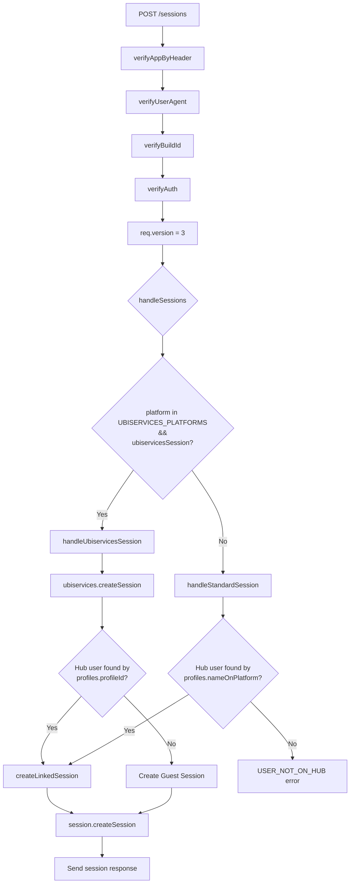
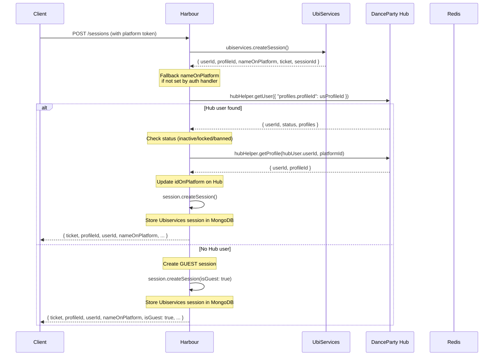
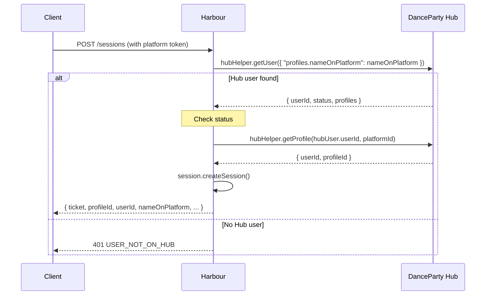

# Session Creation Flow

The session creation flow is the most complex part of the auth system. It's triggered by `POST /v3/profiles/sessions` (and `POST /v2/profiles/sessions`) and lives in `src/lib/session-client.js`.

## Entry Point: `handleSessions`



## Platform Routing

The routing decision in `handleSessions`:

```javascript
const UBISERVICES_PLATFORMS = ["ps4", "nx", "uplay"];

const handleSessions = async (req, res, next) => {
    const platformId = req.platform.id;

    if (UBISERVICES_PLATFORMS.includes(platformId) && req.ubiservicesSession) {
        return await handleUbiservicesSession(req, res, next);
    }
    return await handleStandardSession(req, res, next);
};
```

| Platform | `platform.id` | `ubiservicesSession` | Route |
|---|---|---|---|
| PS4 | `ps4` | `true` | `handleUbiservicesSession` |
| Nintendo Switch | `nx` | `true` | `handleUbiservicesSession` |
| Uplay PC (official) | `uplay` | `true` | `handleUbiservicesSession` |
| Wii U | `wiiu` | `false` | `handleStandardSession` |
| Uplay PC (cracked) | `uplay` | `false` | `handleStandardSession` |
| Basic | `basic` / `ios` / `android` | `false` | `handleStandardSession` |

## Ubiservices Path: `handleUbiservicesSession`

Used by PS4, Nintendo Switch, and official Uplay PC.

### Flow



### Guest Sessions

When a Ubiservices-authenticated user is not found on the Hub, a **guest session** is created instead of returning an error. This allows users to play without linking their console account to the Hub.

Guest sessions have:
- `isGuest: true` in the ticket claims
- All admin/moderator/patreon flags set to `false`
- `jmcsEnv` set to `"prod"`
- The same 3-hour TTL as normal sessions

### `nameOnPlatform` Fallback

```javascript
// Some auth paths (e.g. official PC) don't have nameOnPlatform from
// local token parsing — use the value Ubisoft returned instead.
if (!req.nameOnPlatform) req.nameOnPlatform = usNameOnPlatform;
```

## Standard Path: `handleStandardSession`

Used by Wii U, cracked Uplay PC, and Basic auth.

### Flow



### No Guest Sessions

Unlike the Ubiservices path, the standard path **blocks** users who aren't on the Hub. This is because:
- **WiiU** uses Pretendo identity — linking is required
- **Cracked PC** already created a Hub profile in `pc-crack.verify()` — the user should exist
- **Basic** is an explicit Hub login — the user must exist

## Shared Flow: `createLinkedSession`

Both paths converge here once a Hub user is confirmed. This function:

1. **Checks account status** — inactive/locked/banned accounts are rejected
2. **Gets the platform profile** from Hub — returns `USER_DOESNT_HAVE_PLATFORM` if missing
3. **Updates `idOnPlatform`** on Hub (for platforms that provide it, like WiiU)
4. **Creates the Harbour session** via `session.createSession()` — encrypts claims into a ticket
5. **Stores Ubiservices session** in MongoDB (only if `usData` is present — i.e., from the Ubiservices path)
6. **Returns the session response** to the client

### Account Status Checks

```javascript
const { status } = hubUser;
if (status.inactiveAccount) return next(INACTIVE_ACCOUNT);   // 403
if (status.locked)         return next(LOCKED_ACCOUNT);       // 403
if (status.banned)         return next(BANNED_ACCOUNT);       // 403
```

## Session Response

All session creation paths return the same shape:

```json
{
  "platformType": "nx",
  "ticket": "<harbour-jwt-encrypted-ticket>",
  "twoFactorAuthenticationTicket": null,
  "profileId": "<hub-profile-uuid>",
  "userId": "<hub-user-uuid>",
  "nameOnPlatform": "PlayerName",
  "environment": "Prod",
  "expiration": "2026-06-26T12:00:00.000Z",
  "spaceId": "<space-uuid>",
  "clientIp": "1.2.3.4",
  "clientIpCountry": "US",
  "isAdmin": false,
  "isModerator": false,
  "jmcsEnv": "prod",
  "isGuest": false,
  "serverTime": "2026-06-26T12:00:00.000Z",
  "sessionId": "<session-uuid>",
  "sessionKey": "tOUfMdjy38N7ORzNcsXofATeXCKDiwnIzNsfo7h2qhD3Z+WV9RWpQEYWUg0J+XtuXom+qOi04+5eS3CcCz/99w==",
  "rememberMeTicket": null,
  "token": null,
  "accountIssues": null,
  "hasAcceptedLegalOptins": true
}
```

## Session Deletion: `handleSessionDeletion`

```mermaid
sequenceDiagram
    participant C as Client
    participant H as Harbour
    participant U as UbiServices
    participant M as MongoDB
    participant R as Redis
    
    C->>H: DELETE /sessions
    Note over C,H: Authorization: Ubi_v1 t=&lt;ticket&gt;
    H->>H: ticketRequired → extract sessionId
    H->>R: Check session exists
    
    H->>M: Find UbiservicesSession by harbourSessionId
    alt Ubiservices session exists
        H->>U: ubiservices.deleteSession()
        M-->>H: UbiservicesSession document
        H->>M: Delete UbiservicesSession document
    end
    
    H->>R: Delete session from Redis
    H-->>C: 200 {}
```
