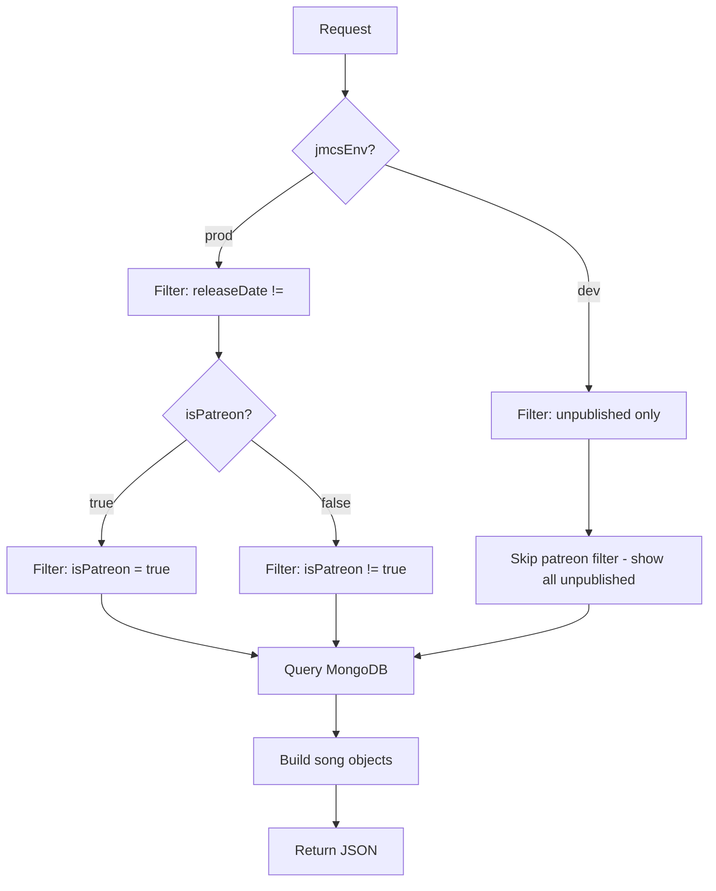
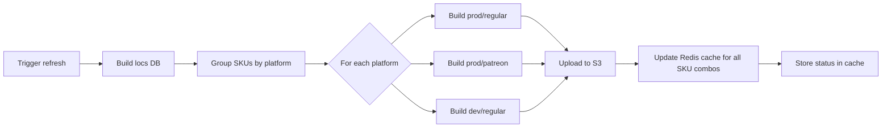

# SongDB System

The Song Database (SongDB) is the core of JMCS — it builds, caches, and serves the complete song catalogue for Just Dance games. There are two generations of the system: **v1** (inline response) and **v2** (S3-backed signed URLs).

---

## V1 — Inline SongDB

**Service:** `songdb.v1.ts`  
**Route:** `GET /songdb/v1/songs`

### How it works

The v1 endpoint calls `songs.buildSongDb()` directly and returns the entire song database as a JSON object in the response body.

```
Request  →  [ticketRequired, skuIdRequired]  →  buildSongDb()  →  Response (JSON)
```

### Build pipeline

`songs.buildSongDb()` queries MongoDB with filters based on the requesting user's context:

| Parameter    | Description |
|-------------|-------------|
| `platform`  | Target platform (nx, ps4, wiiu, etc.). Assets are extracted per-platform. |
| `jmcsEnv`   | `"prod"` → published songs only (`releaseDate != ""`). `"dev"` → unpublished/draft songs only. |
| `isPatreon` | `true` → patreon-only songs. `false`/`undefined` → exclude patreon songs. |

### Filtering logic



### Song object shape

Each song in the database is transformed into a client-facing object:

```typescript
{
  artist: string,
  assets: { /* platform-specific URLs */ },
  coachCount: number,
  difficulty: number,
  mapName: string,
  mode: number,
  title: string,
  tags: string[],
  isPatreon: boolean,
  // ... plus many more fields
}
```

### Additional v1 routes

| Method | Route | Auth | Description |
|--------|-------|------|-------------|
| `POST` | `/songdb/v1/songs/:mapName` | Admin/PkgMgr | Create a new song |
| `GET` | `/songdb/v1/songs/:mapName` | Admin/PkgMgr | Fetch a single song |
| `PUT` | `/songdb/v1/songs/:mapName` | Admin/PkgMgr | Update a song |
| `DELETE` | `/songdb/v1/songs/:mapName` | Admin/PkgMgr | Delete a song |
| `GET` | `/songdb/v1/backoffice` | Admin/PkgMgr | List all songs (raw) |
| `GET` | `/songdb/v1/wdf` | S2S | Songs for World Dance Floor |
| `GET` | `/songdb/v1/tags` | Admin/PkgMgr | List all tags |
| `POST` | `/songdb/v1/tags` | Admin/PkgMgr | Create a tag |
| `GET` | `/songdb/v1/audit` | Admin | Run song audit |

---

## V2 — S3-Backed SongDB

**Service:** `songdb.v2.ts`  
**Routes:** `GET /songdb/v2/songs`, `POST /songdb/v2/songs/refresh`, `GET /songdb/v2/songs/status`

### How it works

V2 moves the song database to S3. Instead of building the DB on every request, it:

1. Checks Redis cache for the S3 path of the pre-built database.
2. If cached — returns a signed download URL.
3. If not cached — builds the DB, uploads to S3, caches the path, then returns the URL.

```
Request  →  Redis cache hit?  →  Yes  →  Return signed S3 URL
                               →  No   →  buildSongDb() → Upload to S3 → Cache path → Return signed URL
```

### Cache key structure

```
jmcs:songdb:path:{skuId}:{envTag}:{patreonTag}
```

| Part          | Values |
|---------------|--------|
| `{skuId}`     | e.g. `jd2023.nxe.us` |
| `{envTag}`    | `prod` or `dev` |
| `{patreonTag}` | `regular` or `patreon` |

### S3 path structure

```
{config.ENV}/songdb[.dev][.patreon].{platform}.{hash}.json
```

| Variant | Example |
|---------|---------|
| Prod regular | `prod/songdb.nx.a858727fb57.json` |
| Prod patreon | `prod/songdb.patreon.nx.ad41bb27bd5.json` |
| Dev regular | `prod/songdb.dev.nx.c5cb207869e.json` |
| Dev patreon | *(uses dev regular — no separate build)* |

### V2 response

```json
{
  "requestSpecificMaps": {},
  "songdbUrl": "https://s3.amazonaws.com/...?signed",
  "localisationUrl": "https://s3.amazonaws.com/...?signed",
  "localMaps": []
}
```

### Refresh flow

`POST /songdb/v2/songs/refresh` (admin-only) triggers a full rebuild:



### Database variants

| Variant | Songs included | Used by |
|---------|---------------|---------|
| **prod/regular** | Published, non-patreon | Normal users on production |
| **prod/patreon** | Published, patreon-only | Patreon subscribers on production |
| **dev/regular** | All unpublished (regardless of patreon) | Dev/testing environments |
| **dev/patreon** | *(not built — dev regular covers both)* | — |

### Status endpoint

`GET /songdb/v2/songs/status` returns the last refresh metadata:

```json
{
  "success": true,
  "status": {
    "lastRefreshedAt": "2026-06-27T12:00:00.000Z",
    "triggeredBy": "System",
    "songDbPaths": { "nx": "...", "ps4": "...", "wiiu": "..." },
    "devSongDbPaths": { "nx": "...", "ps4": "...", "wiiu": "..." },
    "patreonSongDbPaths": { "nx": "...", "ps4": "...", "wiiu": "..." }
  }
}
```

---

## Key differences: V1 vs V2

| Aspect | V1 | V2 |
|--------|----|----|
| **Response** | Full JSON in body | Signed S3 URLs |
| **Build timing** | Every request (if not cached in memory) | On cache miss + refresh trigger |
| **Caching** | Runtime only | Redis + S3 (persistent) |
| **Storage** | MongoDB query results | Pre-built JSON files on S3 |
| **Infos DB** | Merged into response | Not included (v2 only) |
| **Use case** | Backward compatibility, admin tools | Primary game client consumption |
